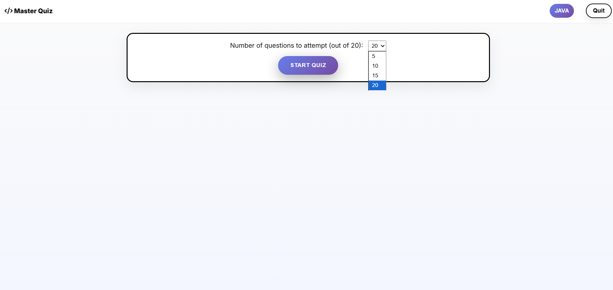
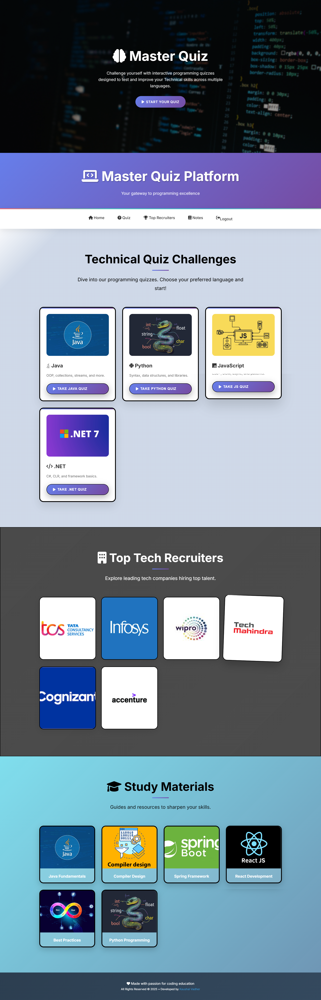
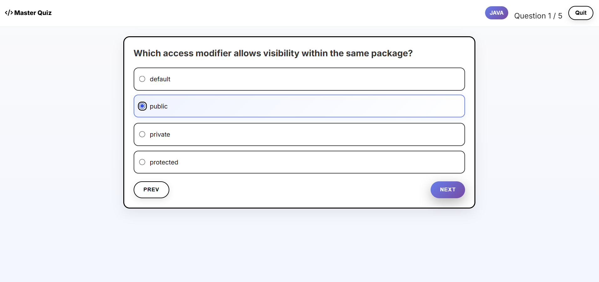
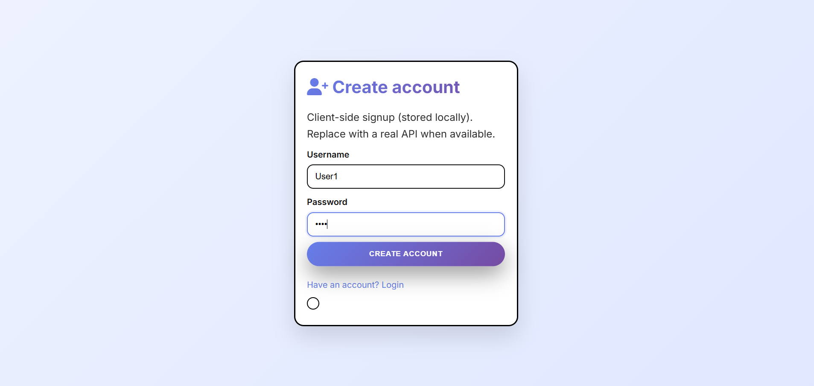
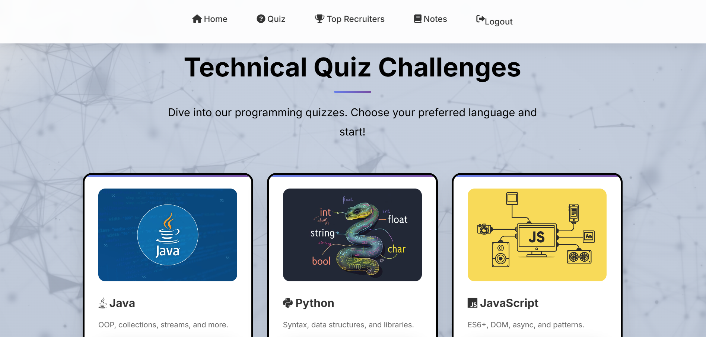
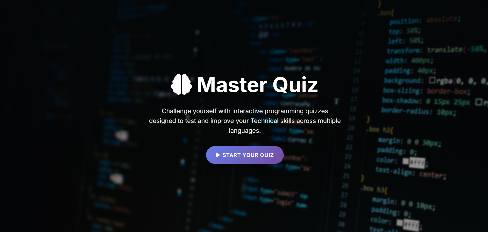
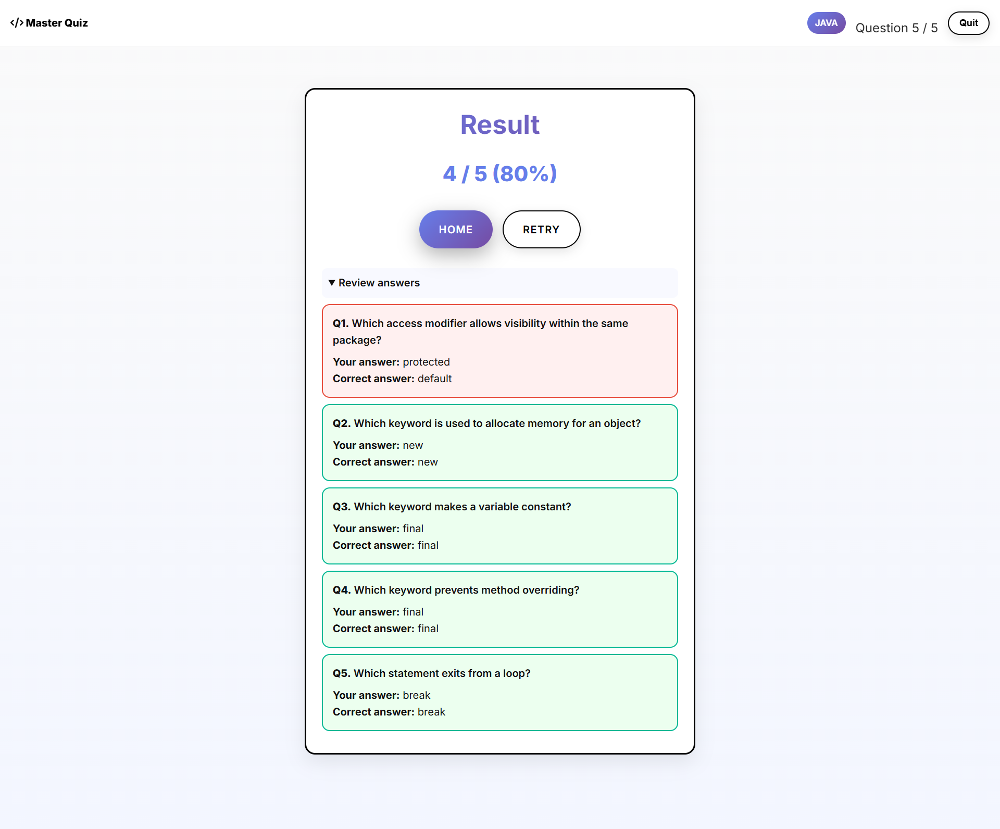

# 🎓 Master Quiz – Java Spring Boot 

An **interactive quiz application** built with **Spring Boot (Java)** for the backend and **HTML, CSS, and Vanilla JavaScript** for the frontend.  
It allows users to **sign up, log in, and attempt quizzes** from different programming categories like **Java, Python, JavaScript, and .NET**.

---

## ✨ Features
- 🔐 **User Authentication**
  - Secure **Signup** & **Login** (via Spring Boot backend)
  - Session management with `localStorage`

- 🧑‍💻 **Quiz System**
  - Fetch questions from backend API
  - Category-based quizzes (`/questions/category/{category}`)
  - Score calculation and detailed review after submission

- 🎨 **Frontend UI**
  - Responsive HTML, CSS, and JS
  - Separate pages:
    - `index.html` → Landing & Quiz Categories
    - `login.html` → User login
    - `signup.html` → User signup
    - `quiz.html` → Quiz player
  - Modern CSS with gradient themes

- 📚 **Extensible**
  - Easily add more categories & questions
  - Backend powered by JPA/Hibernate & MySQL

---

## 🛠️ Tech Stack

### Backend
- **Spring Boot**
- **Spring Data JPA / Hibernate**
- **MySQL** (for users & quiz data)
- REST APIs (`/api/login`, `/api/signup`, `/api/questions`)

### Frontend
- **HTML5, CSS3, JavaScript**
- Responsive UI with custom styling
- Auth-aware header with login/logout handling

---

# Master Quiz – Interactive Programming Quiz Platform

> **Challenge yourself with interactive programming quizzes** designed to test and improve your technical skills across **Java, Python, JavaScript, .NET**, and more.

---

## 🚀 Live Demo
*(Replace with your live URL when hosted)*  
🔗 [https://your-username.github.io/QUIZAPP](https://your-username.github.io/QUIZAPP)

---

## 📸 Screenshots

| Home Page | Quiz Selection |
|-----------|----------------|
|  |  |

| Taking Quiz | Result Screen |
|-------------|----------------|
|  |  |

| Create Account | Start Quiz |
|----------------|------------|
|  |  |

---

## ✨ Features

- **Multi-language Quizzes**: Java, Python, JavaScript, .NET  
- **Interactive UI** with real-time feedback  
- **Local Account Creation** (client-side storage)  
- **Progress Tracking** & detailed result review  
- **Responsive Design** – works on mobile & desktop  
- **Review Answers** with correct explanations  
- **Custom Quiz Length** (5, 10, 15, or 20 questions)  

---

## 🛠️ Tech Stack

- **HTML5**  
- **CSS3** (Custom styling with modern UI)  
- **JavaScript** (Vanilla JS – DOM manipulation, localStorage)  
- **No backend** – Fully client-side  

---

## 📁 Project Structure

